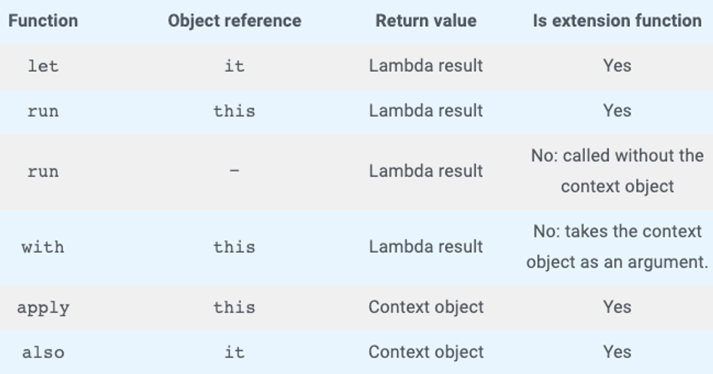

# 6장. 문자열 처리

- 문자열 처리와 관련된 알고리즘이 쓰이는 대표적인 분야
    - 정보 처리 분야: 어떤 키워드로 웹 페이지를 탐색(검색엔진)할 때 문자열 처리 애플리케이션을 이용하게 된다. 특히 현대의 거의 모든 정보는 문자열로 구성되어 있으며, 문자열 처리는 정보 처리에 핵심적인 역할을 한다.
    - 통신 시스템 분야: 문자 메시지나 이메일을 보낼 때 기본적으로 문자열을 어느 한 곳에서 다른 곳으로 보내게 된다. 데이터 전송은 문자열 처리 알고리즘이 탄생한 기원이기도 하며, 데이터 전송에서 문자열 처리는 매우 중요한 역할을 한다.
    - 프로그래밍 시스템 분야: 프로그램은 그 자체가 문자열로 구성되어 있다. 컴파일러나 인터프리터 등은 문자열을 해석하고 처리해 기계어로 변환하는 역할을 하며, 여기에는 매우 정교한 문자열 처리 알고리즘이 쓰인다.

# 1. 유효한 팰린드롬

---

- [https://leetcode.com/problems/valid-palindrome/](https://leetcode.com/problems/valid-palindrome/)
- 주어진 문자열이 팰린드롬인지 확인하라. 대소문자를 구분하지 않으며, 영숫자(영문자와 숫자)만을 대상으로 한다.
- 나의 풀이
    
    ```python
    import re
    
    class Solution:
        def isPalindrome(self, s: str) -> bool:
            target = "".join(re.findall("[\dA-Za-z]*", s.lower()))
            splitSeq = len(target) // 2
    
            if len(target) % 2 == 0:
                s2 = target[splitSeq:]
            else:
                s2 = target[splitSeq + 1:]
    
            return target[:splitSeq] == s2[::-1]
    ```
    

## 풀이1. 문자 단위로 추출해서 처리

---

- 자바의 기본 문자열 자료형인 `String`은 기본적으로 문자열 처리를 위한 다양한 기능을 지원한다.
- 이 문제의 경우 문자열에서 문자를 하나씩 추출해 비교해야 하기 때문에 문자열 자료형을 그대로 사용하기보다는 문자를 하나씩 추출하는 방식이 비교적 비교하기 편하다.
    - 추출하려면 `charAt()` 메소드에 인덱스를 지정하면 된다.
    
    ```powershell
    kim-yoonhee@gim-yunhuiui-MacBookPro-2 ~ % jshell
    |  Welcome to JShell -- Version 17.0.7
    |  For an introduction type: /help intro
    
    jshell> String s = "Do Geese see God?"
    s ==> "Do Geese see God?"
    
    jshell> s.charAt(13);
    $2 ==> 'G'
    ```
    
- 이 문제의 경우 '대소문자를 구분하지 않으며, 영숫자만을 대상으로 한다'는 제약 조건이 있다.
    
    ```powershell
    jshell> Character.toLowerCase('G');
    $3 ==> 'g'
    
    jshell> Character.isLetterOrDigit('G');
    $4 ==> true
    ```
    

- 이제 문자열에서 맨 앞의 문자와 맨 뒤의 문자를 추출한 다음 유효한 문자(영숫자)인지를 확인하고 모두 소문자로 변경한 뒤에 일치 여부를 판별하면 된다.
    - 그렇게 맨 앞에서는 한 칸씩 뒤로, 맨 뒤에서는 한 칸씩 앞으로 서로를 향해 계속 비교하면서 중앙으로 이동해 나가다가, 겹치는 지점에 무사히 도달한다면 해당 문자열은 팰린드롬이라고 판별할 수 있다.
    
    ```java
    public boolean isPalindrome(String s) {
        int start = 0;
        int end = s.length() - 1;
        // 서로 중앙으로 이동해 나가다 겹치는 지점에 도달하면 종료
        while (start < end) {
            // 영숫자인지 판별하고 유효하지 않으면 한 칸씩 이동
            if (!Character.isLetterOrDigit(s.charAt(start))) {
                start++;
            } else if (!Character.isLetterOrDigit(s.charAt(end))) {
                end--;
            } else { // 유효한 문자라면 앞 글자와 뒷 글자를 모두 소문자로 변경해 비교
                if (Character.toLowerCase(s.charAt(start)) != Character.toLowerCase(s.charAt(end))) {
                    // 하나라도 일치하지 않는다면 팰린드롬이 아니므로 false 리턴
                    return false;
                }
                // 앞쪽 문자는 한 칸 뒤로, 뒤쪽 문자는 한 칸 앞으로 이동
                start++;
                end--;
            }
        }
        // 무사히 종료될 경우 팰린드롬이므로 true 리턴
        return true;
    }
    ```
    

## 풀이2. 문자열 직접 비교

---

- 이번에는 문자 단위로 추출하지 않고, 문자열을 직접 비교해서 풀이해 보겠다.
- `String` 클래스는 문자열을 치환할 수 있는 몇 가지 메소드를 제공하며, 그중에는 `replaceAll()`처럼 정규식을 지원하는 메소드도 있다.
    
    ```powershell
    jshell> String s = "Do geese see God?";
    s ==> "Do geese see God?"
    
    jshell> s.replaceAll("[^A-Za-z0-9]", "").toLowerCase();
    $9 ==> "dogeeseseegod"
    ```
    
- `StringBuilder`는 `reverse()`라는 뒤집는 메소드를 제공하며, 이후 `toString()`을 이용해 `String`으로 변경하면 이제 원래 문자열과 동일한 자료형이 되어 서로 값을 비교할 수 있다.
    
    ```powershell
    # 문자열을 뒤집은 다음 String으로 변경
    jshell> new StringBuilder("god").reverse().toString();
    $10 ==> "dog"
    ```
    
    - `StringBuilder`는 스레드 안전하지 않다. 문자열 처리에 스레드 안전이 필요한 경우는 거의 없으나 이 점에 유의하기 바란다.

- 전체 코드
    
    ```java
    public boolean isPalindrome(String s) {
        // 정규식으로 유효한 문자만 추출한 다음 모두 소문자로 변경
        String s_filtered = s.replaceAll("[^A-Za-z0-9]", "").toLowerCase();
        // 문자열을 뒤집은 다음 String으로 변경
        String s_reversed = new StringBuilder(s_filtered).reverse().toString();
        // 두 문자열이 동일한지 비교
        return s_filtered.equals(s_reversed);
    }
    ```
    

😃 코드가 매우 간결해졌다.

🥲 원시 자료형인 `char`로 비교하는 풀이 #1과 달리, 클래스를 직접 비교하는 이번 풀이는 실행 속도가 훨씬 더 느리다. 게다가 앞부분에는 정규식까지 사용해 속도 저하가 매우 크다.

## 풀이3. 코틀린 풀이

---

- 풀이 #1을 코틀린으로 구현. `if else` 구현은 코틀린을 이용하면 `when` 표현식으로 깔끔하게 처리할 수 있다.
- 자바의 `swtich` 절은 반드시 변수를 지정해야 하고 그 변수의 값에 따라서 분기를 하는 데 반해, 코틀린의 `when`은 변수를 지정하지 않아도 조건만 일치한다면 분기할 수 있다.

- 전체 코드
    
    ```kotlin
    fun isPalindrome(s: String): Boolean {
        var start = 0
        var end = s.length - 1
        //서로 중앙으로 이동해 나가다 겹치는 지점에 도달하면 종료
        while (start < end) {
            when {
                // 영숫자인지 판별하고 유효하지 않으면 뒤로 한 칸 이동
                !Character.isLetterOrDigit(s[start]) -> start++
                // 영숫자인지 판별하고 유효하지 않으면 앞으로 한 칸 이동
                !Character.isLetterOrDigit(s[end]) -> end--
                else -> {
                    // 이 외에는 유효한 문자이므로 앞뒤 글자를 모두 소문자로 변경하여 비교
                    if (Character.toLowerCase(s[start]) != Character.toLowerCase(s[end])) {
                        // 하나라도 일치하지 않는다면 팰린드롬이 아니므로 false 리턴
                        return false
                    }
                    // 앞쪽 문자는 한 칸 뒤로, 뒤쪽 문자는 한 칸 앞으로 이동
                    start++
                    end--
                }
            }
        }
        // 무사히 종료될 경우 팰린드롬이므로 true 리턴
        return true
    }
    ```
    
    - 자바는 `s.charAt(6)` 형태였으나 코틀린은 마치 파이썬처럼 `s[6]`으로 6번째 문자를 추출할 수 있다.
        - 자바에서 `charAt()` 메소드의 리턴값은 `char`이고 원시 자료형인 데 반해, 코틀린에서 인덱스로 직접 접근해 추출한 결과는 원시 자료형이 아니라 `Char`라는 코틀린 클래스로서 참조형이다.
            - 하지만 코틀린은 경우에 따라 원시 자료형을 사용한다.(4장)
        - 그래서 풀이 #2와 같은 속도 문제는 발생하지 않는다.
    - 풀이 #2는 `String` 클래스의 기능을 바로 사용하므로 편리하고 풀이 또한 깔끔했으나, 클래스 간 비교가 되어 속도 면에서 많은 손해를 봤다.
        - 하지만 코틀린은 경우에 따라 원시 자료형을 지원하므로 클래스 간 비교를 수행하더라도 자바에서 원시 자료형을 직접 비교했을 때와 속도 차이가 거의 없다.
    
    | 풀이 | 방식 | 실행 시간 |
    | --- | --- | --- |
    | 1 | 문자 단위로 추출해서 처리 | 5밀리초 |
    | 2 | 문자열 직접 비교 | 796밀리초 |
    | 3 | 코틀린 풀이 | 측정하지 않음 |

# 2. 문자열 뒤집기

---

- [https://leetcode.com/problems/reverse-string/](https://leetcode.com/problems/reverse-string/)
- 문자열을 뒤집는 함수를 작성하라. 입력값은 문자 배열이며, 리턴 없이 입력 배열 내부를 직접 조작하라.
- 나의 풀이
    
    ```python
    class Solution:
        def reverseString(self, s: List[str]) -> None:
            """
            Do not return anything, modify s in-place instead.
            """
            start = 0
            end = len(s) - 1
            
            while start < end:
                imsi = s[start]
                s[start] = s[end]
                s[end] = imsi
                
                start += 1
                end -= 1
    ```
    

## 풀이1. 문자 배열로 스왑

---

- 문자열에서 맨 앞 문자와 맨 뒤 문자를 추출한 다음 중앙에서 만날 때까지 서로 스왑하면서 한 칸씩 이동하면 쉽게 해결할 수 있다.
- 자바에서 값 스왑은 주로 임시 변수를 이용해 다음과 같이 처리한다.
    
    ```powershell
    jshell> char[] arr = {'a', 'b'}
    arr ==> char[2] { 'a', 'b' }
    
    jshell> char temp = arr[0]
    temp ==> 'a'
    
    jshell> arr[0] = arr[1]
    $13 ==> 'b'
    
    jshell> arr[1] = temp
    $14 ==> 'a'
    
    jshell> arr
    arr ==> char[2] { 'b', 'a' }
    ```
    

- 전체 코드
    
    ```java
    public void reverseString(char[] s) {
        int start = 0;
        int end = s.length - 1;
        // 서로 중앙으로 이동해 나가다 겹치는 지점에 도달하면 종료
        while (start < end) {
            // 임시 변수를 이용해 값 스왑
            char temp = s[start];
            s[start] = s[end];
            s[end] = temp;
            
            // 앞쪽 문자는 한 칸 뒤로, 뒤쪽 문자는 한 칸 앞으로 이동
            start++;
            end--;
        }
    }
    ```
    

## 풀이2. 코틀린 풀이

---

- 자바의 스왑을 코틀린에서는 다음과 같이 좀 더 우아하게 변경할 수 있다.
    
    ```kotlin
    s[start] = s[end].also { s[end] = s[start] }
    ```
    
- `also`는 코틀린에서 모든 객체에 기본으로 제공하는 함수이며, 속성의 변경 없이 중괄호 내 명령이 실행된다.
    
    
    

- 전체 코드
    
    ```kotlin
    fun reverseString(s: CharArray): Unit {
        var start = 0
        var end = s.size - 1
        //서로 중앙으로 이동해 나가다 겹치는 지점에 도달하면 종료
        while (start < end) {
            // also를 이용해 우아하게 스왑
            s[start] = s[end].also { s[end] = s[start] }
    
            // 앞쪽 문자는 한 칸 뒤로, 뒤쪽 문자는 한 칸 앞으로 이동
            start++
            end--
        }
    }
    ```
    

| 풀이 | 방식 | 실행 시간 |
| --- | --- | --- |
| 1 | 문자 배열로 스왑 | 1밀리초 |
| 2 | 코틀린 풀이 | 측정하지 않음 |

# 3. 로그 파일 재정렬

---

- [https://leetcode.com/problems/reorder-data-in-log-files/](https://leetcode.com/problems/reorder-data-in-log-files/)
- 로그를 재정렬하라. 기준은 다음과 같다.
    1. 로그의 가장 앞부분은 식별자로서, 순서에 영향을 끼치지 않는다.
    2. 문자로 구성된 로그가 숫자 로그보다 앞에 오며, 문자 로그는 사전순으로 한다.
    3. 문자가 동일할 경우에는 식별자순으로 한다.
    4. 숫자 로그는 입력 순서대로 한다.
- 나의 풀이
    
    ```python
    def reorderLogFiles(self, logs: List[str]) -> List[str]:
        digit_logs = []
        letter_dict = {}
        
        for log in logs:
            words = log.split()
            
            if words[1].isdigit():
                digit_logs.append(" ".join(words))
            else:
                identifier, content = words[0], " ".join(words[1:])
                letter_dict[(content, identifier)] = log
    
        # sort_list = [t[0] + " " + t[1] for t in sorted(letter_dict.items(), key=lambda x:(x[1],x[0]))]
        return [log for (_, _), log in sorted(letter_dict.items())] + digit_logs
    ```
    

## 풀이1. 문자 로그와 숫자 로그를 구분해 각각 처리

---

- 문자 로그와 숫자 로그는 서로 정렬 방식이 다르므로, 둘을 아예 분리해 정렬하고 나중에 결과를 서로 이어 붙이는 편이 아무래도 처리하기 더 편할 것 같다.
- `Collections.sort()`에 `Comparator`를 이용하면 이처럼 정렬 조건을 설정하고 정렬할 수 있다.
    - 만약 두 값이 동일하다면 0, 비교 대상의 순서가 앞으로 와야 할 경우에는 1, 비교 대상의 순서가 뒤에 머물러야 할 경우에는 -1이 된다.
    - 자바 8 이상 버전에서는 복잡한 `Comparator`를 일일이 지정하는 대신 람다 표현식으로 간단히 대체할 수 있다. 람다는 실행 속도 또한 훨씬 더 빠르므로 개선하는 형태를 권장한다.

- 전체 코드
    
    ```java
    public String[] reorderLogFiles(List<String> logs) {
        // 문자 로그를 저장할 문자 리스트
        List<String> letterList = new ArrayList<>();
        // 숫자 로그를 저장할 숫자 리스트
        List<String> digitList = new ArrayList<>();
    
        for (String log : logs) {
            // 로그 종류 확인 후 숫자 로그라면 숫자 리스트에 삽입
            if (Character.isDigit(log.split(" ")[1].charAt(0))) {
                digitList.add(log);
            } else {
                // 숫자 로그가 아니라면 문자 리스트에 삽입
                letterList.add(log);
            }
        }
    
        // 문자 리스트 정렬 진행
        letterList.sort((s1, s2) -> {
            // 식별자와 식별자 외 나머지 부분, 이렇게 두 부분으로 나눈다.
            String[] s1x = s1.split(" ", 2);
            String[] s2x = s2.split(" ", 2);
    
            // 문자 로그 사전순 비교
            int compared = s1x[1].compareTo(s2x[1]);
            // 문자가 동일한 경우 식별자 비교
            if (compared == 0) {
                return s1x[0].compareTo(s2x[0]);
            } else {
                // 비교 대상의 순서가 동일한 경우 0, 순서가 앞인 경우 1, 순서가 뒤인 경우 -1이 된다.
                return compared;
            }
        });
    
        // 문자 리스트 뒤로 숫자 리스트를 이어 붙인다.
        // 숫자 로그는 '입력 순서대로'라는 제약 조건이 있으므로 따로 정렬하지 않는다.
        letterList.addAll(digitList);
    
        // 리스트를 String 배열로 변환해 리턴한다.
        return letterList.toArray(new String[0]);
    }
    ```
    

## 풀이2. 코틀린 풀이

---

```kotlin
fun reorderLogFiles(logs: List<String>): Array<String> {
    // 문자 로그를 저장할 문자 리스트
    val letterList = mutableListOf<String>()
    // 숫자 로그를 저장할 숫자 리스트
    val digitList = mutableListOf<String>()

    for (log in logs) {
        // 로그 종류 확인 후 숫자 로그라면 숫자 리스트에 삽입
        if (Character.isDigit(log.split(" ")[1][0])) {
            digitList.add(log)
        } else {
            // 숫자 로그가 아니라면 문자 리스트에 삽입
            letterList.add(log)
        }
    }

    // 문자 리스트 정렬 진행
    letterList.sortWith(Comparator { s1: String, s2: String ->
        // 식별자와 식별자 외 나머지 부분, 이렇게 두 부분으로 나눈다.
        val s1x = s1.split(" ", limit = 2)
        val s2x = s2.split(" ", limit = 2)

        // 문자 로그 사전순 비교
        val compared = s1x[1].compareTo(s2x[1])
        // 문자가 동일한 경우 식별자 비교
        if (compared == 0) {
            s1x[0].compareTo(s2x[0])
        } else {
            // 비교 대상의 순서가 동일한 경우 0, 순서가 앞인 경우 1, 순서가 뒤인 경우 -1이 된다.
            compared
        }
    })

    // 문자 리스트 뒤로 숫자 리스트를 이어 붙인다.
    // 숫자 로그는 '입력 순서대로'라는 제약 조건이 있으므로 따로 정렬하지 않는다.
    letterList.addAll(digitList)

    // 리스트를 String 배열로 변환해 리턴한다.
    return letterList.toTypedArray()
}
```

- 약간의 차이라면 자바의 경우와 달리 `sort()` 대신 `sortWith()`를 사용한다는 점이며, `Comparator` 또한 명시적으로 선언한다는 차이 정도만 있다.

| 풀이 | 방식 | 실행 시간 |
| --- | --- | --- |
| 1 | 문자 로그와 숫자 로그를 구분하여 각각 처리 | 4밀리초 |
| 2 | 코틀린 풀이 | 특정하지 않음 |

# 4. 가장 흔한 단어

---

- [https://leetcode.com/problems/most-common-word/](https://leetcode.com/problems/most-common-word/)
- 금지된 단어를 제외하고 가장 흔하게 등장하는 단어를 출력하라. 대소문자를 구분하지 않으며, 구두점(마침표, 쉼표 등) 또한 무시한다.
- 나의 풀이
    
    ```python
    import re
    
    class Solution:
        def mostCommonWord(self, paragraph: str, banned: List[str]) -> str:
            target_list = re.findall("[\dA-Za-z]*", paragraph.lower())
            count_dict = {}
    
            for target in target_list:
                if target in banned or not target:
                    continue
                count_dict[target] = count_dict.get(target, 0) + 1
    
            # return [k for k, v in sorted(count_dict.items(), key=lambda item: item[1], reverse = True)][0]
            return max(count_dict, key=count_dict.get)
    ```
    

## 풀이1. 전처리 작업 후 개수 처리 및 추출

---

- 입력값에 대한 전처리(Preprocessing) 작업이 필요하다.
    - 정규식에서 `\W`는 단어 문자가 아닌 것을 뜻한다.(W가 대문자임에 유의하자)
        - 참고로, 단어 문자를 뜻할 때는 소문자 `\w`를 사용한다.
    - 문자 뒤에 `+`를 붙이면 연속적인 값을 의미한다.
- 이 외에 제약 조건으로 대소문자를 구분하지 않으므로 `toLowerCase()`로 모두 소문자로 바꿔주며, `split(" ")`을 써서 띄어쓰기를 기준으로 단어를 모두 분리한다.
- 다음으로 해야 할 일은 금지된 단어를 제외하고 각 단어가 몇 차례나 등장하는지 개수를 헤아릴 차례다.
    - `Collections.max()`는 이름 그대로 가장 큰 값을 찾는다.
    - `counts.entrySet()`: [the=1, a=1, ball=2, away=1, far=1, flew=1, ross=1, was=1, after=1, it=1]
    - 찾는 기준은 `Map.Entry.comparingByValue()`다.
        - 값을 기준으로 비교한다는 의미이며, 즉 counts라는 키-값 해시맵의 값을 기준으로 최댓값을 찾는다.
    - 그다음에는 `getKey()`로, 최종적으로 키만 가져오게 된다.

- 전체 코드
    
    ```java
    public String mostCommonWord(String p, String[] banned) {
        // 금지어 목록이 String 배열이므로, 비교 메소드를 제공하는 Set으로 변경한다.
        Set<String> ban = new HashSet<>(Arrays.asList(banned));
        // 각 단어별 개수가 저장될 키-값 맵
        Map<String, Integer> counts = new HashMap<>();
    
        // 전처리 작업 후 단어 목록을 배열로 저장
        String[] words = p.replaceAll("\\W+", " ").toLowerCase().split(" ");
    
        for (String w : words) {
            // 금지된 단어가 아닌 경우 개수 처리
            if (!ban.contains(w)) {
                // 존재하지 않는 단어라면 기본값을 0으로 지정. 추출한 값에 +1 하여 저장
                counts.put(w, counts.getOrDefault(w, 0) + 1);
            }
        }
        // 가장 흔하게 등장하는 단어 추출
        return Collections.max(counts.entrySet(), Map.Entry.comparingByValue()).getKey();
    }
    ```
    

## 풀이2. 코틀린 풀이

---

- 코틀린은 원시 자료형이 아니라 모든 것이 객체이기 때문에 입력값의 자료형인 `Array<String>`도 이미 객체이며, `contains()` 같은 메소드를 제공한다.
    - 굳이 `Set`으로 변경할 필요가 없다.
- 코틀린에서는 널 가능성이 있기 때문에 뒤에 `!!`를 부여했는데, 행여나 널인 경우 널 포인터 예외가 발생할 수 있기 때문에 원래는 반드시 널 처리를 해줘야 하며 주의가 필요하다.
    - 여기서는 문제의 제약 조건에 따라 널이 아님이 확실함

- 전체 코드
    
    ```kotlin
    fun mostCommonWord(p: String, banned: Array<String>): String {
        // 각 단어별 개수가 저장될 키-값 맵
        val counts: MutableMap<String, Int> = mutableMapOf()
    
        // 전처리 작업 후 단어 목록을 배열로 저장
        val words = p.replace("\\W+".toRegex(), " ").toLowerCase().trim().split(" ")
    
        for (w in words) {
            // 금지된 단어가 아닌 경우 개수 처리
            if (!banned.contains(w)) {
                // 존재하지 않는 단어라면 기본값을 0으로 지정
                // 추출한 값에 +1 하여 저장
                counts[w] = counts.getOrDefault(w, 0) + 1
            }
        }
    
        // 가장 흔하게 등장하는 단어 추출
        return counts.maxByOrNull { it.value }!!.key
    }
    ```
    

| 풀이 | 방식 | 실행 시간 |
| --- | --- | --- |
| 1 | 전처리 작업 후 개수 처리 및 추출 | 18밀리초 |
| 2 | 코틀린 풀이 | 측정하지 않음 |

# 5. 그룹 애너그램

---

- [https://leetcode.com/problems/group-anagrams/](https://leetcode.com/problems/group-anagrams/)
- 문자열 배열을 받아 애너그램 단위로 그룹핑하라.
- 나의 풀이
    
    ```python
    def groupAnagrams(self, strs: List[str]) -> List[List[str]]:
        result_map = {}
        
        for s in strs:
            key = ''.join(sorted(s))
            result_map[key] = result_map.get(key, []) + [s]
            
        return list(result_map.values())
    ```
    

## 풀이1. 정렬하여 비교

---

- 애너그램을 판단하는 가장 간단한 방법은 정렬하여 비교하는 것이다. 애너그램을 이루는 단어들을 정렬하면 모두 같은 값을 갖게 되기 때문이다.
- 우선, 정렬한 값을 보관하기 위한 맵을 선언한다.
    - 하나의 키에 여러 개의 값이 추가될 수 있기 때문에 값은 리스트 형태가 되며, 따라서 맵은 리스트를 값으로 둔 형태로 선언한다.
    
    ```java
    Map<String, List<String>> results = new HashMap<>();
    ```
    
- 다음으로 입력값을 하나씩 순회하면서 정렬한다.
    - 애너그램을 이루는 단어들은 정렬하면 같은 값이 된다고 앞서 언급한 바 있다.
    
    ```java
    for (String s : strs) {
        char[] chars = s.toCharArray();
        Arrays.sort(chars);
        ...
        Strign key = String.valueOf(chars);
        
        if (!results.containsKey(key))
            results.put(key, new ArrayList<>());
        results.get(key).add(s);
    }
    ```
    
- results를 문제에서 요구한 출력 형태로 바꿔주면 된다.
    
    ```java
    [
        ["ate","eat","tea"],
        ["ant","tan"],
        ["cat"]
    ]
    ```
    
    - `Map<String, List<String>>`을 `List<List<String>>`으로 바꿔주면 된다.
    - 키가 필요 없는 형태이기 때문에 단순히 값만 추출해 다음과 같이 변경해주면 된다.
        
        ```java
        return new ArrayList<>(results.values());
        ```
        

- 전체 코드
    
    ```java
    public List<List<String>> groupAnagrams(String[] strs) {
        // 애너그램 결과를 보관하기 위한 맵 선언 
        Map<String, List<String>> results = new HashMap<>();
        // 입력값인 문자열 배열을 순회
        for (String s : strs) {
            // 문자열을 문자 배열로 변환
            char[] chars = s.toCharArray();
            // 문자 배열 정렬
            Arrays.sort(chars);
            // 문자 배열을 키로 하기 위해 다시 문자열로 변환
            String key = String.valueOf(chars);
    
            // 만약 기존에 없던 키라면 빈 리스트를 삽입
            if (!results.containsKey(key))
                results.put(key, new ArrayList<>());
            // 키에 해당하는 리스트에 추가
            results.get(key).add(s);
        }
        // 문제에서 요구하는 출력값 형태로 변경
        return new ArrayList<>(results.values());
    }
    ```
    

## 풀이2. 코틀린 풀이

---

- 자바 구현에서는 먼저 문자열을 `char[]` 형태의 문자 배열로 변환한 다음, `Arrays.sort()`로 정렬하고 다시 문자열 `String`으로 변경하는 과정을 거쳤다.
    - 코틀린에서는 이 과정을 단 한줄로 처리 가능하다.
        
        ```kotlin
        val key = s.toCharArray().sorted().joinToString("")
        ```
        
- 자바에서는 키 존재 유무를 확인해서 키가 없으면 빈 리스트를 삽입하고, 이후에는 키에 해당하는 리스트에 값을 추가했다.
    - 코틀린에서는 `getOrPut()` 메소드를 이용해 이 과정을 좀 더 간결하게 처리할 수 있다.

- 전체 코드
    
    ```kotlin
    fun groupAnagrams(strs: Array<String>): List<List<String>> {
        // 애너그램 결과를 보관하기 위한 맵 선언
        val results: MutableMap<String, MutableList<String>> = mutableMapOf()
    
        // 입력값인 문자열 배열을 순회
        for (s in strs) {
            // 문자열 정렬
            val key = s.toCharArray().sorted().joinToString("")
            // 만약 기존에 없던 키라면 빈 리스트를 삽입
            results.getOrPut(key) { mutableListOf() }
            // 키에 해당하는 리스트에 추가
            results[key]!!.add(s)
        }
        // 문제에서 요구하는 출력값 형태로 변경
        return ArrayList<List<String>>(results.values)
    }
    ```
    

| 풀이 | 방식 | 실행 시간 |
| --- | --- | --- |
| 1 | 정렬하여 비교 | 6밀리초 |
| 2 | 코틀린 풀이 | 측정하지 않음 |

# 6. 가장 긴 팰린드롬 부분 문자열

---

- [https://leetcode.com/problems/longest-palindromic-substring/](https://leetcode.com/problems/longest-palindromic-substring/)
- 가장 긴 팰린드롬 부분 문자열을 출력하라
- 나의 풀이
    
    ```python
    def extendPalindrome(self, s: str, j: int, k: int) -> None:
        # 투 포인터가 유효한 범위 내에 있고 양쪽 끝 문자가 일치하는 팰린드롬인 경우 범위 확장
        while j >= 0 and k < len(s) and s[j] == s[k]:
            j -= 1
            k += 1
    
        # 기존 최대 길이보다 큰 경우 값 교체
        if self.maxLen < k - j - 1:
            self.left = j + 1
            self.maxLen = k - j - 1
    
    def longestPalindrome(self, s: str) -> str:
        # 문자 길이 저장
        length = len(s)
    
        # 길이가 1인 경우 예외 처리
        if length < 2:
            return s
    
        # 초기화
        self.left = 0
        self.maxLen = 0
    
        # 우측으로 한 칸씩 이동하며 투 포인터 조사
        for i in range(length - 1):
            self.extendPalindrome(s, i, i + 1)  # 2칸짜리 투 포인터
            self.extendPalindrome(s, i, i + 2)  # 3칸짜리 투 포인터
    
        # 왼쪽과 최대 길이만큼을 더한 오른쪽만큼의 문자를 정답으로 리턴
        return s[self.left:self.left + self.maxLen]
    ```
    

## 풀이1. 팰린드롬을 발견하면 확장하는 풀이

---

- 2칸, 3칸으로 구성된 투 포인터가 슬라이딩 윈도우처럼 계속 앞으로 전진해 나간다. 이때 윈도우에 들어온 문자열이 팰린드롬인 경우 그 자리에 멈추고, 투 포인터는 점점 확장하는 식이다.
    - dcbabcdd 기준,
        - 팰린드롬은 dd처럼 짝수일 때도 있고, bab처럼 홀수일 때도 있다.
    - 따라서 짝수나 홀수 모든 경우에 대해 판별한다.
- 지금까지 설명한 내용을 코드로 구현해보자.
    - 먼저 길이가 1인 문자열도 입력값이 될 수 있기 때문에 그대로 돌려주는 예외 처리를 하고 시작한다.
        
        ```java
        int len = s.length();
        if (len < 2) return s;
        ```
        
    - 이제 입력 문자열을 두고 우측으로 한 칸씩 이동하며 2칸짜리와 3칸짜리, 2개의 투 포인터로 조사해 나간다.
        
        ```java
        for (int i = 0; i < len - 1; i++) {
            extendPalindrome(s, i, i + 1);
            extendPalindrome(s, i, i + 2);
        }
        ```
        
        - extendPalindrome()으로 정의한 함수는 2칸짜리와 3칸짜리, 2개의 투 포인터가 팰린드롬 여부를 판별하면서 슬라이딩 윈도우처럼 계속 우측으로 이동한다.
            - extendPalindrome() 함수 내부에서는 양쪽 끝 문자가 일치하는 경우 팰린드롬으로 보고 윈도우 크기를 점점 더 키운다.
            - 이렇게 판별한 최대 길이에 해당하는 문자열이 최종 결과가 된다.

- 전체 코드
    
    ```java
    int left, maxLen;
    
    public void extendPalindrome(String s, int j, int k) {
        // 투 포인터가 유효한 범위 내에 있고 양쪽 끝 문자가 일치하는 팰린드롬인 경우 범위 확장
        while (j >= 0 && k < s.length() && s.charAt(j) == s.charAt(k)) {
            j--;
            k++;
        }
    
        // 기존 최대 길이보다 큰 경우 값 교체
        if (maxLen < k - j - 1) {
            left = j + 1;
            maxLen = k - j - 1;
        }
    }
    
    public String longestPalindrome(String s) {
        // 문자 길이 저장
        int len = s.length();
    
        // 길이가 1인 경우 예외 처리
        if (len < 2) return s;
    
        // 우측으로 한 칸씩 이동하며 투 포인터 조사
        for (int i = 0; i < len - 1; i++) {
            extendPalindrome(s, i, i + 1); // 2칸짜리 투 포인터
            extendPalindrome(s, i, i + 2); // 3칸짜리 투 포인터
        }
        // 왼쪽과 최대 길이만큼을 더한 오른쪽만큼의 문자를 정답으로 리턴
        return s.substring(left, left + maxLen);
    }
    ```
    

## 풀이2. 코틀린 풀이

---

```kotlin
var left = 0
var maxLen: Int = 0

fun extendPalindrome(s: String, j: Int, k: Int) {
    // 파라미터는 수정할 수 없으므로 var 별도 선언
    var l = j
    var r = k
    // 투 포인터가 유효한 범위 내에 있고 양쪽 끝 문자가 일치하는 팰린드롬인 경우 범위 확장
    while (l >= 0 && r < s.length && s[l] == s[r]) {
        l--
        r++
    }

    // 기존 최대 길이보다 큰 경우 값 교체
    if (maxLen < r - l - 1) {
        left = l + 1
        maxLen = r - l - 1
    }
}

fun longestPalindrome(s: String): String {
    // 문자 길이 저장
    val len = s.length

    // 길이가 1인 경우 예외 처리
    if (len < 2) return s

    // 우측으로 한 칸씩 이동하며 투 포인터 조사
    for (i in 0 until len - 1) {
        extendPalindrome(s, i, i + 1) // 2칸짜리 투 포인터
        extendPalindrome(s, i, i + 2) // 3칸짜리 투 포인터
    }
    // 왼쪽과 최대 길이만큼을 더한 오른쪽만큼의 문자를 정답으로 리턴
    return s.substring(left, left + maxLen)
}
```

| 풀이 | 방식 | 실행 시간 |
| --- | --- | --- |
| 1 | 팰린드롬을 발견하면 확장하는 풀이 | 22밀리초 |
| 2 | 코틀린 풀이 | 측정하지 않음 |

<aside>
💡 코틀린의 읽기전용 함수 파라미터

- 코틀린은 함수에서 넘겨받은 파라미터를 수정할 수 없다.
- 일례로 참조형을 '값에 의한 호출(Call By Value)'로 넘기면 그 객체를 바라보는 참조 값 자체가 넘어가는 것이기 때문에,
    - 만약 컬렉션 자료형을 파라미터로 넘길 경우 어떤 메소드에서 내부 값을 수정해버리면 원래 값이 함께 수정된다는 문제가 있다.
- 자바는 값에 의한 호출만 가능하기 때문에 이후에 결과를 출력해보면 메소드를 호출하기 전과 동일한 값이 출력되어야 할 것 같다.
    - 그러나 실제로 출력해보면 엘리먼트에 값이 추가된 버전이 출력된다.
    - 변수 a는 참조형이어서 그 객체를 바라보는 참조 값 자체가 넘어갔기 때문이다.

👉 자바는 값에 의한 호출만 가능하지만, 자료형에 따라 마치 참조에 의한 호출인 것처럼 동작한다.

- 코틀린은 파라미터로 넘겨받은 값을 수정할 수 없도록 제약을 가했다.
    - 따라서 코틀린에서는 함수에서 파라미터로 넘겨받은 값은 모두 읽기 전용이며, 수정할 수 없다.
</aside>